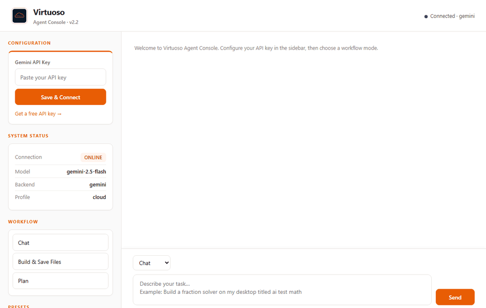

# Virtuoso CLI Agent

Lightweight AI coding agent for **8GB laptops**: chat, plan, build files, use a browser dashboard, and plug into **VS Code / Cursor** through an OpenAI-compatible local API.


<p align="center">
  
</p>

## Why Virtuoso?

Most coding agents assume a powerful workstation, a paid model account, or a heavy local setup. Virtuoso is built for ordinary laptops: Gemini-first cloud mode, optional local Shimmy models, a browser dashboard for non-terminal workflows, and editor integration when you want it.

Use it when you want a small, hackable coding agent that can run on modest hardware without giving up the useful pieces: chat memory, planning, build/save flows, presets, and IDE-compatible API serving.

## Features

- **Gemini (default)** — cloud inference with `/gemini setup` and multi-turn chat
- **OpenAI-compatible APIs** — OpenRouter, Groq, Together, OpenAI via `/openai setup`
- **Shimmy (optional)** — local offline models via `/profile local`
- **File output** — `/build` saves to Desktop when you say "on my desktop titled …"
- **IDE server** — `python virtuoso.py --serve` for Continue, Cline, etc.
- **Agent tools** — `/plan`, `/build`, `/search`, `/read`, sandboxed `/run`
- **Presets** — `/fix`, `/explain`, `/test`, `/refactor`, `/review`
- **Standalone exe** — `dist/virtuoso.exe` (Windows)

## 60-second demo

```bash
# After cloning this repository:
cd virtuoso-cli-agent
python scripts/setup_dev.py
python virtuoso.py --dashboard
```

Open the dashboard, paste a Gemini API key, choose **Build**, and try:

```text
make a Python todo app on my desktop titled todo
```

## Quick start

```bash
pip install -r requirements.txt
cp virtuoso.yaml.example virtuoso.yaml   # Windows: copy virtuoso.yaml.example virtuoso.yaml
python virtuoso.py
```

One-command local setup after cloning:

```bash
python scripts/setup_dev.py
```

Windows shortcut:

```bat
setup.bat
```

### Browser dashboard (recommended UI)

```bash
python virtuoso.py --dashboard
```

Opens **http://127.0.0.1:8788** in your browser — chat, build, plan, and presets without typing in the raw console.

Windows shortcut: double-click `start_dashboard.bat` in the project root (or `dist\virtuoso.exe` after building).

Other UIs:

| UI | Command | Best for |
|----|---------|----------|
| **Browser dashboard** | `python virtuoso.py --dashboard` | Chat + build + save files |
| Terminal dashboard | `python virtuoso.py --tui` | Keyboard-only terminal UI |
| Cursor / VS Code | `python virtuoso.py --serve` + Continue | Coding inside your editor |

First launch runs a short wizard. Then:

```
/gemini setup          # paste API key from https://aistudio.google.com/apikey
hello                  # chat directly at >
/status
```

Check your local setup at any time:

```bash
python virtuoso.py --doctor
python virtuoso.py --version
```

### Profiles

```
/profile cloud    # Gemini (default)
/profile local    # Shimmy — then /shimmy install && /shimmy start
```

### Alternative to Google (API key)

```
/openai setup          # wizard: OpenRouter, Groq, Together, or OpenAI
/openai openrouter     # quick setup for OpenRouter (free models available)
/backend openai        # switch after setup
```

Popular options:

| Provider | Get key | Notes |
|----------|---------|-------|
| [OpenRouter](https://openrouter.ai/keys) | Free tier models | Easiest Gemini alternative |
| [Groq](https://console.groq.com/keys) | Fast inference | Good for chat |
| [OpenAI](https://platform.openai.com/api-keys) | Paid | `gpt-4o-mini` default |
| Shimmy (local) | No key | `/profile local` — needs GPU/RAM |

### Save files from `/build`

```
/build a python fraction solver on my desktop titled ai test math
/build --save C:\Users\you\Desktop\script.py my goal here
/save C:\Users\you\Desktop\script.py    # save last build output manually
```

### IDE integration

```bash
python virtuoso.py --serve
```

Point Continue at `http://127.0.0.1:8765/v1` — see [docs/continue_integration.md](docs/continue_integration.md).

Copy-paste examples are available in [examples/](examples/), including prompts and Continue/OpenRouter config snippets.

## How it compares

| Tool | Best for | Virtuoso difference |
|------|----------|--------------------|
| Cursor / Cline | IDE-native coding workflows | Virtuoso is CLI/dashboard first and exposes a local OpenAI-compatible API for editor use. |
| Open Interpreter | General computer-control tasks | Virtuoso focuses on coding agent flows: plan, build, review, save, and IDE serving. |
| Ollama-based tools | Local-model workflows | Virtuoso defaults to Gemini for 8GB laptops and keeps local Shimmy optional. |
| Cloud coding agents | Hosted development | Virtuoso is local-first, hackable, and keeps config/state on your machine. |

## Commands

| Command | Description |
|---------|-------------|
| `> your question` | Chat (with memory) |
| `/gemini setup` | Configure API key |
| `/profile cloud\|local` | Switch cloud vs local |
| `/serve` | Start IDE API (or use `--serve` flag) |
| `/plan`, `/build` | Reasoning and multi-agent codegen |
| `/fix`, `/explain`, `/test` | Preset prompts |
| `/shimmy start` | Local model server |
| `/backend shimmy` | Switch backend at runtime |
| `/clear` | Reset conversation |
| `/status` | Backend health |
| `/exit` | Quit |

## Configuration

Copy the template if you have not already:

```bash
cp virtuoso.yaml.example virtuoso.yaml
```

Edit `virtuoso.yaml` (this file is gitignored — never commit API keys):

```yaml
llm:
  backend: gemini-apikey
  gemini:
    model: gemini-2.5-flash
    api_key: ""   # or use GEMINI_API_KEY env var
  shimmy:
    model_path: virtuoso_data/models/Qwen2.5-Coder-0.5B-Instruct-Q4_K_M.gguf
sandbox:
  enabled: true
cli:
  active_profile: cloud
  ide_server_port: 8765
```

## Standalone executable

```bash
python scripts/build_standalone.py
# Output: dist/virtuoso.exe (bundles virtuoso.yaml.example with empty keys)
```

On first run beside the exe, config is copied to `virtuoso.yaml` next to the executable — add your API key there or use `/gemini setup`.

Place `virtuoso_data/` beside the exe for Shimmy and local models.

## VS Code extension

Load `vscode-extension/` as an unpacked extension for commands to open the CLI and IDE server.

## Hardware guide

| Machine | Recommended |
|---------|-------------|
| 8GB laptop, integrated GPU | **Gemini** (`/profile cloud`) |
| Discrete GPU / 16GB+ RAM | Gemini or **Shimmy** local |
| Offline only | `/profile local` + 0.5B model |

## SWE-bench (optional — not for 8GB laptops)

Benchmark scripts under `scripts/` need **Docker**, **16+ GB RAM**, and large disk. They are not required for normal use. On an 8GB machine the runner exits with a clear message; use Virtuoso via Gemini instead.

## Known limits

- Cloud backends require your own API key.
- Shimmy/local inference depends heavily on your GPU/RAM and model size.
- `/run` is lightweight process isolation, not a hardened sandbox for untrusted code.
- SWE-bench scripts are optional and resource-heavy; they are not needed for normal use.
- Gemini/OpenAI responses can be wrong; review generated code before running it.

## Development

```bash
pip install -e ".[dev]"
python -m pytest tests/ -q --ignore=tests/test_gemini_integration.py
```

More project docs:

- [Architecture](docs/architecture.md)
- [Roadmap](docs/roadmap.md)
- [Demo recording script](docs/demo_script.md)
- [Good first issue ideas](docs/good_first_issues.md)

## Privacy

- **Gemini** sends prompts to Google.
- **Shimmy** runs entirely on your machine.

## License

[MIT](LICENSE)
